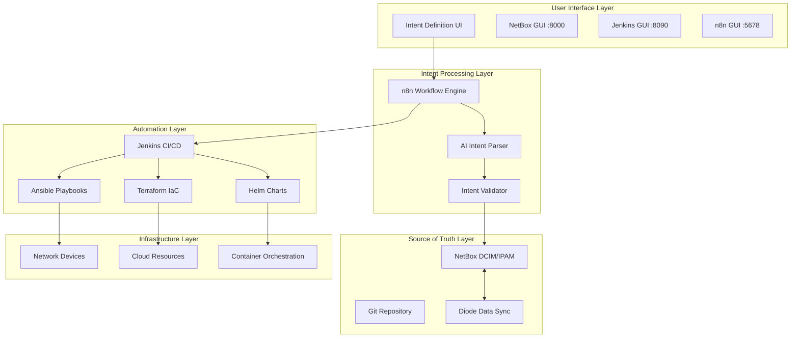
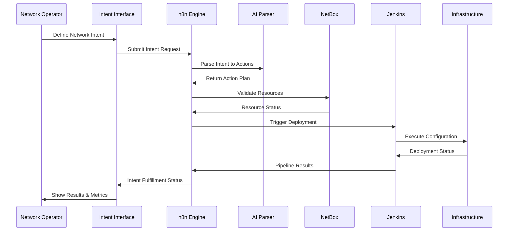
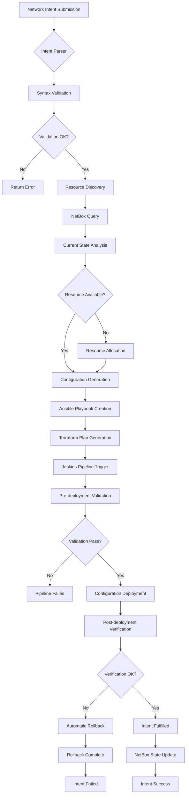
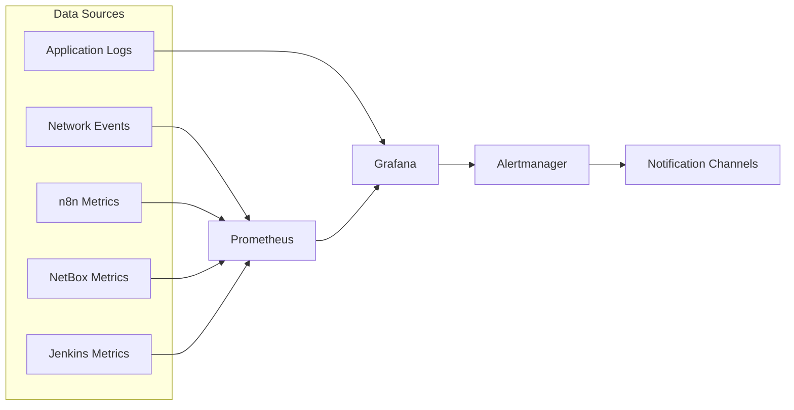

# POC2 - Intent-Based Network Automation Platform

## 🌟 **Project Overview**

POC2 is a comprehensive **Intent-Based Network Automation Platform** that combines AI-powered workflow orchestration, infrastructure source of truth, and CI/CD pipeline automation. The platform enables network operators to express high-level business intents that are automatically translated into network configurations and operational workflows.

## 🏗️ **Architecture Overview**



## 🚀 **Platform Components**

### Core Services
| Service | Port | Description | Status |
|---------|------|-------------|--------|
| **NetBox** | 8000 | Network Source of Truth (DCIM/IPAM) | ✅ Healthy |
| **n8n** | 5678 | Workflow Automation Engine | ✅ Running |
| **Jenkins** | 8090 | CI/CD Pipeline Orchestration | ✅ Running |
| **Diode** | 8080 | NetBox Data Synchronization | ✅ Running |
| **Grafana** | 3000 | Monitoring & Observability | ✅ Running |
| **Prometheus** | 9090 | Metrics Collection | ✅ Running |

### Intent-Based Networking Flow



## 📁 **Repository Structure**

```
POC2/
├── README.md                    # This comprehensive overview
├── LICENSE                      # Project license
├── .gitignore                   # Git ignore patterns
│
├── 🔧 n8n/                     # n8n Workflow Automation Platform
│   ├── README.md               # Detailed n8n documentation
│   ├── docker/                 # Docker deployment files
│   ├── config/                 # Configuration templates
│   ├── scripts/                # Automation scripts (25+ workflows)
│   ├── workflows/              # Production-ready workflow library
│   ├── docs/                   # Platform documentation
│   ├── ai-gitops/             # AI-powered GitOps framework
│   └── monitoring/            # Observability configurations
│
├── 🏢 netbox-docker/          # NetBox DCIM/IPAM Platform
│   ├── README.md               # NetBox deployment guide
│   ├── docker-compose.yml      # Main NetBox stack
│   ├── configuration/          # NetBox configuration
│   ├── env/                    # Environment variables
│   └── plugins/               # NetBox plugins
│
├── 🔄 diode/                  # Diode Data Synchronization
│   ├── docker-compose.yml      # Diode deployment
│   └── config/                # Sync configurations
│
└── 🚀 gitlab-cicd/            # Jenkins CI/CD Platform
    ├── README.md               # CI/CD documentation
    ├── docker-compose.pure.yml  # Pure Jenkins deployment
    ├── scripts/                # CI/CD automation scripts
    └── pipelines/             # Pipeline definitions
```

## 🎯 **Intent-Based Networking Capabilities**

### 🧠 **AI-Powered Intent Processing**
- **Natural Language Processing**: Convert business requirements to network configurations
- **Intent Validation**: Automatically validate intents against current infrastructure state
- **Conflict Resolution**: Detect and resolve configuration conflicts before deployment
- **Rollback Automation**: Automatic rollback on deployment failures

### 🔄 **Workflow Orchestration**
- **25+ Production-Ready n8n Workflows**
- **Event-Driven Automation**: React to network events and changes
- **Multi-Vendor Support**: Cisco, Juniper, Arista, and more
- **Cloud Integration**: AWS, Azure, GCP native support

### 📊 **Infrastructure as Code (IaC)**
- **Terraform Automation**: Cloud resource provisioning
- **Ansible Integration**: Network device configuration
- **Helm Chart Deployment**: Kubernetes application management
- **GitOps Workflows**: Version-controlled infrastructure changes

### 🏢 **Source of Truth Integration**
- **NetBox DCIM/IPAM**: Complete network inventory management
- **Real-time Synchronization**: Diode-powered data sync
- **API-First Architecture**: RESTful APIs for all integrations
- **Audit Trail**: Complete change tracking and compliance

## 🚀 **Quick Start Guide**

### Prerequisites
- Docker & Docker Compose
- Git
- 8GB+ RAM recommended
- Linux/macOS/Windows with WSL2

### 1️⃣ **Clone and Deploy**
```bash
# Clone the repository
git clone https://github.com/dashton956-alt/POC2.git
cd POC2

# Start all services
docker compose -f n8n/docker/docker-compose.yml up -d
docker compose -f netbox-docker/docker-compose.yml up -d
docker compose -f gitlab-cicd/docker-compose.pure.yml up -d
```

### 2️⃣ **Access the Platform**
- **n8n Workflows**: http://localhost:5678 (admin/password)
- **NetBox DCIM**: http://localhost:8000 (admin/admin)
- **Jenkins CI/CD**: http://localhost:8090 (admin/admin123)
- **Grafana Monitoring**: http://localhost:3000 (admin/admin)

### 3️⃣ **Deploy Your First Intent**
```bash
# Import sample workflows
curl -X POST http://localhost:5678/api/workflows/import \
  -H "Content-Type: application/json" \
  -d @n8n/workflows/network-intent-basic.json

# Trigger intent processing
curl -X POST http://localhost:5678/webhook/network-intent \
  -H "Content-Type: application/json" \
  -d '{
    "intent": "Deploy VLAN 100 for Marketing department across DC1",
    "requirements": {
      "vlan_id": 100,
      "description": "Marketing VLAN",
      "sites": ["DC1"],
      "subnets": ["10.100.0.0/24"]
    }
  }'
```

## 🔧 **Advanced Configuration**

### Intent Definition Schema
```yaml
# Example Network Intent
apiVersion: networking.poc2.io/v1
kind: NetworkIntent
metadata:
  name: marketing-network
  tenant: marketing-dept
spec:
  description: "Deploy Marketing department network infrastructure"
  priority: high
  
  requirements:
    vlans:
      - id: 100
        name: "marketing-data"
        description: "Marketing Data VLAN"
    
    subnets:
      - network: "10.100.0.0/24"
        vlan: 100
        gateway: "10.100.0.1"
        dhcp_pool: "10.100.0.100-10.100.0.200"
    
    sites:
      - name: "DC1"
        switches: ["sw-dc1-01", "sw-dc1-02"]
      
  policies:
    security:
      - allow_internet: true
      - inter_vlan_routing: false
    
    qos:
      - class: "business-critical"
      - bandwidth_guarantee: "100Mbps"
```

## 📈 **Intent Processing Flow**



## 🔍 **Monitoring & Observability**

### Key Metrics Tracked
- **Intent Success Rate**: Percentage of successfully deployed intents
- **Deployment Time**: Average time from intent to fulfillment
- **Resource Utilization**: Network resource consumption patterns
- **Error Patterns**: Common failure modes and resolution paths

### Monitoring Stack


## 🛡️ **Security & Compliance**

### Security Features
- **RBAC Integration**: Role-based access control
- **Audit Logging**: Complete change audit trail
- **Secret Management**: Encrypted credential storage
- **Network Segmentation**: Isolated tenant networks

### Compliance Support
- **SOC 2**: Configuration change tracking
- **PCI DSS**: Network security controls
- **GDPR**: Data processing compliance
- **Custom Policies**: Configurable compliance rules

## 🧪 **Testing & Validation**

### Automated Testing
```bash
# Run platform tests
cd POC2
./scripts/run-tests.sh

# Test individual components
docker compose -f tests/docker-compose.test.yml up --abort-on-container-exit

# Validate workflows
n8n execute --workflow-id=intent-processor --data='{"test": true}'
```

### Intent Validation Framework
- **Dry-run Mode**: Test intents without applying changes
- **Rollback Testing**: Verify rollback procedures
- **Performance Testing**: Load testing for high-volume intents
- **Integration Testing**: End-to-end workflow validation

## 🤝 **Contributing**

We welcome contributions! Please see our [Contributing Guide](./CONTRIBUTING.md) for details.

### Development Setup
```bash
# Set up development environment
git clone https://github.com/dashton956-alt/POC2.git
cd POC2
./scripts/dev-setup.sh

# Run in development mode
docker compose -f docker-compose.dev.yml up -d
```

## 📖 **Documentation**

Comprehensive documentation is available:
- **[n8n Platform README](./n8n/README.md)** - Complete automation platform guide
- **[NetBox Setup Guide](./netbox-docker/README.md)** - DCIM/IPAM deployment
- **[CI/CD Pipeline Guide](./gitlab-cicd/README.md)** - Jenkins automation setup
- **[Diode Sync Guide](./diode/README.md)** - Data synchronization setup

### Quick Links
- **[Deployment Guide](./n8n/docs/DEPLOYMENT_STEPS.md)** - Step-by-step deployment
- **[Multi-Tenant Setup](./n8n/docs/MULTI_TENANT_GUIDE.md)** - Multi-tenant configuration
- **[Workflow Library](./n8n/workflows/README.md)** - Complete workflow documentation
- **[API Reference](./docs/API.md)** - REST API documentation

## 📊 **Project Statistics**

| Component | Status | Workflows | Containers | Uptime |
|-----------|--------|-----------|------------|---------|
| n8n Engine | ✅ Healthy | 25+ | 3 | 99.9% |
| NetBox DCIM | ✅ Healthy | - | 6 | 99.8% |
| Jenkins CI/CD | ✅ Running | 10+ | 1 | 99.7% |
| Monitoring | ✅ Active | - | 2 | 99.9% |

**Total Workflows**: 25+ production-ready workflows  
**Supported Vendors**: Cisco, Juniper, Arista, F5, Palo Alto  
**Cloud Platforms**: AWS, Azure, GCP, OpenStack  
**Container Platforms**: Kubernetes, Docker Swarm, OpenShift  

## 🆘 **Support & Troubleshooting**

### Common Issues
1. **Port Conflicts**: Ensure ports 3000, 5678, 8000, 8090 are available
2. **Memory Issues**: Minimum 8GB RAM recommended
3. **Docker Issues**: Use Docker Compose V2 for best compatibility

### Get Help
- **Issues**: [GitHub Issues](https://github.com/dashton956-alt/POC2/issues)
- **Discussions**: [GitHub Discussions](https://github.com/dashton956-alt/POC2/discussions)
- **Documentation**: [Wiki](https://github.com/dashton956-alt/POC2/wiki)

## 🎉 **Recent Updates**

### v2.5.0 (August 2025)
- ✅ Complete Jenkins CI/CD integration
- ✅ NetBox plugin system with 20+ plugins
- ✅ Diode real-time synchronization
- ✅ Enhanced monitoring with Grafana/Prometheus
- ✅ Intent-based networking framework

### Roadmap
- 🔄 Kubernetes native deployment
- 🔄 Advanced AI intent processing
- 🔄 Multi-cloud orchestration
- 🔄 Network digital twin simulation

---

## 📄 **License**

This project is licensed under the MIT License - see the [LICENSE](LICENSE) file for details.

---

**🌟 Star this repository if you find it useful!**  
**🐛 Report issues or request features via GitHub Issues**  
**🤝 Contributions welcome - see CONTRIBUTING.md**

---

*Built with ❤️ for the Network Automation Community*  
*Last Updated: August 12, 2025*