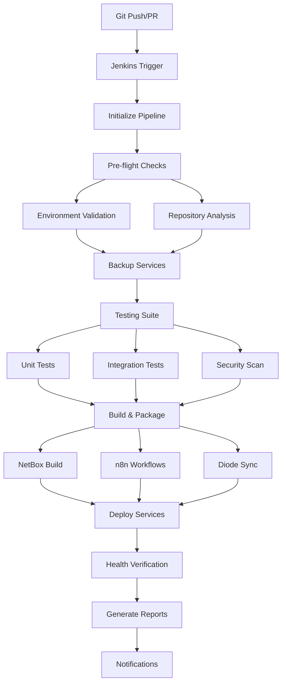

# POC2 Jenkins CI/CD Pipeline Documentation

## Overview

This document describes the comprehensive Jenkins CI/CD pipeline built for the POC2 Intent-Based Networking platform. The pipeline automates deployment, testing, and management of NetBox, n8n, Diode, and Jenkins services.

## Pipeline Architecture



## Pipeline Components

### 1. Jenkinsfile-Modern

**Location:** `gitlab-cicd/jenkins/Jenkinsfile-Modern`

Features:
- **Multi-environment support** (development, staging, production)
- **Parallel execution** for faster builds
- **Comprehensive testing suite**
- **Security vulnerability scanning**
- **Service health monitoring**
- **Slack/email notifications**
- **Artifact management**
- **Rollback capabilities**

### 2. Pipeline Orchestrator

**Location:** `gitlab-cicd/scripts/pipeline-orchestrator.sh`

A comprehensive bash script that handles:
- Service deployment orchestration
- Health checks and monitoring  
- Backup and restore operations
- Environment initialization
- Report generation

### 3. Jenkins Configuration

**Location:** `gitlab-cicd/jenkins/`

- `jenkins.yaml` - Jenkins Configuration as Code (JCasC)
- `plugins.txt` - Required Jenkins plugins
- `Dockerfile.jenkins.minimal` - Custom Jenkins image

## Deployment Types

The pipeline supports multiple deployment strategies:

| Type | Description | Use Case |
|------|-------------|----------|
| `full-stack` | Deploy all services | Complete platform updates |
| `netbox-only` | Deploy NetBox only | DCIM/IPAM changes |
| `n8n-workflows` | Deploy n8n workflows | Automation updates |
| `diode-sync` | Deploy Diode service | Data sync changes |
| `jenkins-only` | Deploy Jenkins | CI/CD updates |
| `health-check` | Run health checks only | Platform monitoring |
| `rollback` | Rollback to previous version | Emergency recovery |

## Pipeline Parameters

### Required Parameters

- **DEPLOYMENT_TYPE**: Select deployment scope
- **DEPLOYMENT_STRATEGY**: Choose deployment method (rolling, blue-green, recreate)

### Optional Parameters

- **SKIP_TESTS**: Skip test execution (not recommended for production)
- **CREATE_BACKUP**: Create backup before deployment (recommended)
- **SKIP_SECURITY_SCAN**: Skip security vulnerability scanning
- **CUSTOM_TAG**: Custom Docker image tag

## Environment Configuration

### Development Environment
```bash
ENVIRONMENT=development
NETBOX_URL=http://localhost:8000
N8N_URL=http://localhost:5678  
DIODE_URL=http://localhost:8080
JENKINS_URL=http://localhost:8090
```

### Staging Environment
```bash
ENVIRONMENT=staging
NETBOX_URL=https://netbox-staging.poc2.local
N8N_URL=https://n8n-staging.poc2.local
DIODE_URL=https://diode-staging.poc2.local
```

### Production Environment
```bash
ENVIRONMENT=production
NETBOX_URL=https://netbox.poc2.local
N8N_URL=https://n8n.poc2.local
DIODE_URL=https://diode.poc2.local
```

## Running the Pipeline

### 1. From Jenkins Web UI

1. Navigate to Jenkins dashboard
2. Select "POC2 Pipeline" job
3. Click "Build with Parameters"
4. Configure deployment options
5. Click "Build"

### 2. From Command Line

```bash
# Initialize environment
./scripts/pipeline-orchestrator.sh init

# Deploy full stack
./scripts/pipeline-orchestrator.sh deploy-full

# Deploy specific service
./scripts/pipeline-orchestrator.sh deploy-netbox

# Run health checks
./scripts/pipeline-orchestrator.sh health-check

# Create backup
./scripts/pipeline-orchestrator.sh backup
```

### 3. Via Git Hooks

The pipeline automatically triggers on:
- Push to `main` branch (production deployment)
- Push to `staging` branch (staging deployment)  
- Pull requests (development testing)
- Scheduled health checks (daily at 2 AM)

## Pipeline Stages

### 1. Initialize Pipeline (🔧)
- Validates environment configuration
- Creates workspace structure
- Loads environment variables
- Sets build metadata

### 2. Pre-flight Checks (🔍)
- **Environment Validation**: Checks prerequisites and tools
- **Repository Analysis**: Determines what services changed

### 3. Backup Services (🗂️)
- Creates timestamped backups of:
  - NetBox database dumps
  - PostgreSQL databases  
  - Configuration files
  - n8n workflows

### 4. Testing Suite (🧪)
- **Unit Tests**: Service-specific testing
- **Integration Tests**: Cross-service connectivity
- **Security Scan**: Vulnerability assessment

### 5. Build & Package (🏗️)
- **NetBox Build**: Custom plugins and configuration
- **n8n Workflows**: Validation and preparation
- **Diode Sync**: Configuration validation

### 6. Deploy Services (🚀)
- Executes deployment based on selected type
- Uses deployment strategy (rolling, blue-green, etc.)
- Monitors deployment progress

### 7. Post-Deployment Verification (🔍)
- **Service Health Check**: API endpoint testing
- **Integration Verification**: End-to-end workflow testing

### 8. Generate Reports (📊)
- Deployment summary
- Service status
- Performance metrics
- Artifact inventory

## Notifications

The pipeline sends notifications via:

### Slack Integration
```json
{
  "webhook": "${SLACK_WEBHOOK}",
  "channel": "#poc2-deployments",
  "events": ["success", "failure", "unstable"]
}
```

### Email Integration  
```yaml
recipients:
  - devops@company.com
  - netops@company.com
events:
  - failure
  - unstable
```

## Monitoring and Logging

### Health Check Endpoints

| Service | Endpoint | Expected Response |
|---------|----------|-------------------|
| NetBox | `/api/status/` | HTTP 200 + JSON status |
| n8n | `/healthz` | HTTP 200 |
| Diode | `/health` | HTTP 200 |
| Jenkins | `/login` | HTTP 200 |

### Log Locations

- **Pipeline logs**: `artifacts/logs/orchestrator.log`
- **Service logs**: `artifacts/logs/[service]-logs.txt`
- **Deployment reports**: `artifacts/reports/deployment-report-*.md`
- **Backups**: `artifacts/backups/backup-*.tar.gz`

## Troubleshooting

### Common Issues

#### 1. Service Health Check Failures
```bash
# Check service status
docker compose ps

# Check service logs  
docker compose logs [service-name]

# Manual health check
curl -f http://localhost:8000/api/status/
```

#### 2. Jenkins Build Failures
```bash
# Check Jenkins logs
docker logs poc2-jenkins

# Restart Jenkins
docker restart poc2-jenkins

# Check Jenkins workspace
docker exec poc2-jenkins ls -la /var/jenkins_home/workspace/
```

#### 3. Network Connectivity Issues
```bash
# Check Docker networks
docker network ls

# Test service connectivity
docker exec poc2-jenkins curl -f http://netbox:8000/api/status/
```

### Recovery Procedures

#### Rollback Deployment
```bash
# Automatic rollback via pipeline
./scripts/pipeline-orchestrator.sh rollback

# Manual rollback
docker compose down
docker compose up -d --scale [service]=0
# Restore from backup
```

#### Restore from Backup
```bash
# List available backups
ls -la artifacts/backups/

# Restore specific backup
tar -xzf artifacts/backups/backup-20250812-1400.tar.gz
# Apply restored configuration
```

## Security Considerations

### Credentials Management
- Use Jenkins credentials store for sensitive data
- Rotate API keys and tokens regularly
- Implement least-privilege access

### Network Security
- Services communicate via internal Docker networks
- External access through reverse proxy only
- TLS encryption for all external communications

### Backup Security
- Encrypt backup files
- Store backups in secure, separate location
- Regular backup restore testing

## Performance Optimization

### Pipeline Optimization
- Parallel stage execution
- Docker layer caching
- Artifact caching between builds

### Resource Management
- Container resource limits
- Health check intervals
- Build timeout configurations

### Monitoring Metrics
- Build duration trends
- Success/failure rates
- Service performance metrics

## Future Enhancements

### Planned Features
- [ ] GitOps integration with ArgoCD
- [ ] Advanced deployment strategies (canary, A/B testing)
- [ ] Automated performance testing
- [ ] Machine learning-based anomaly detection
- [ ] Multi-region deployment support
- [ ] Compliance and audit reporting

### Integration Roadmap
- [ ] Prometheus/Grafana monitoring
- [ ] ELK stack for log aggregation  
- [ ] Hashicorp Vault for secrets management
- [ ] Kubernetes deployment option
- [ ] API-first configuration management
